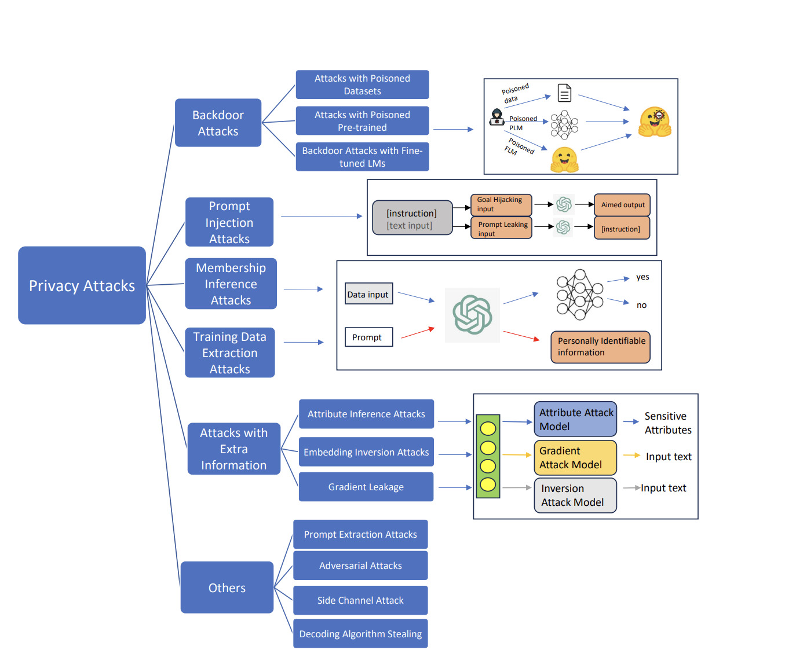

# AI4Privacy Research 

The goal of the AI4Privacy project is to develop language models that can be trained on datasets devoid of personally identifiable information (PII). This is a challenging task, as PII is often present in natural language data. However, it is an important task, as it will enable the development of language models that can be used in a wider range of applications, such as healthcare, finance, and law enforcement.

The project will address the following research questions:

    - Are language models trained on datasets devoid of PII more effective??
    - What are the performance trade-offs of training language models on PII-free datasets?
    - How can language models be used to protect privacy?

## EL Plan
The project will be conducted in three phases:

**Data Collection and Auxillary Models Preparation**

The first phase of the project will involve collecting and preparing a dataset of PII-free text. This will involve identifying and removing PII from existing datasets, as well as collecting new data that is devoid of PII.

    [x] Custom PII masking dataset.
    [x] Train TokenClassification models on custom PII dataset.
    [ ] Validation dataset for PII masking.
    [ ] Compare multiple TokenClassification trained models on the validation dataset.
    [ ] Release PII masked Dataset.
    [ ] Create PII masked Pre-training / finetuning dataset.
    [ ] Train models on masked data.
    [ ] Study activations for the masked model.
    [ ] Test and evaluate the model on benchmarks.
    [ ] Release Open Privacy Enhanced Language Model.(OPEL, name is a work in progress)

**Language Model Training**

***TBD***

The second phase of the project will involve pre-training/finetuning language models on the PII-free dataset. 

**Model Options**
[bee-spoke-team](https://huggingface.co/BEE-spoke-data)

**Pretraining Dataset**

- [JeanKaddour/minipile](https://huggingface.co/datasets/JeanKaddour/minipile)(3.18GB)
- [mattymchen/refinedweb-3m](https://huggingface.co/datasets/mattymchen/refinedweb-3m)(5GB)
- [simple_wikipedia_LM](https://huggingface.co/datasets/pszemraj/simple_wikipedia_LM)(200MB)
- [Skylion007/openwebtext](https://huggingface.co/datasets/Skylion007/openwebtext)(3GB)
- ["wikimedia/wikipedia", "20231101.en"](https://huggingface.co/datasets/wikimedia/wikipedia) (TBD)

**SFT and more**

- Develop privacy-preserving instruction, sft and dpo datasets. 
- Finetune IFT, SFT, and DPO models
- [open-instruct](https://huggingface.co/datasets/VMware/open-instruct)
- [open-hermes](https://huggingface.co/datasets/teknium/openhermes)
- [Ultrachat-200k](https://huggingface.co/datasets/HuggingFaceH4/ultrachat_200k)
- [UltraFeedback](https://huggingface.co/datasets/HuggingFaceH4/ultrafeedback_binarized)

## Evaluation

The project will be evaluated using the following open llm and privacy benchmarks.

***TBD***

 

## Deliverables: 

    - Baseline model on curated pre-training corpus
    - A model to detect and mask PII data.
    - A pretraining corpus devoid of selected PII labels.
    - A set of language models pre-trained on PII-free dataset.
    - Comparison of (Flan-T5, LLaMaV2, Mistral, Zephyr, Yi-6b, Falcon, RedPajama) any comparable model vs AI4PrivacyModel(OPEL) on benchmarks
    - The performance of language models trained on PII-free datasets vs baseline llm.

## Takeaways and questions:
    - To answer the question `Will the development of PII-masked language models broaden the applicability and enhance the effectiveness of such models(OPEL) in various scenarios?`
    - The privacy-preserving properties of language models.
    - The usefulness of language models in privacy.

## References
- [Privacy in Large Language Models: Attacks, Defenses and Future Directions](https://arxiv.org/pdf/2310.10383.pdf)
- [What Does it Mean for a Language Model to Preserve Privacy?](https://dl.acm.org/doi/fullHtml/10.1145/3531146.3534642)
- [Are Large Pre-Trained Language Models Leaking Your Personal Information?](https://aclanthology.org/2022.findings-emnlp.148.pdf)
- [Extracting Training Data from Large Language Models](https://arxiv.org/pdf/2012.07805.pdf)
- [Training Data Extraction From Pre-trained Language Models: A Survey](https://www.semanticscholar.org/reader/0fbf7ea1a3bd1754ed9aa12ed25906b731ece589)
- [Privacy-Preserving Prompt Tuning for Large Language Model Services](https://arxiv.org/pdf/2305.06212.pdf)
- [Backdoor Learning on Sequence to Sequence Models](https://arxiv.org/pdf/2305.02424.pdf)
- [The MiniPile Challenge for Data-Efficient Language Models](https://arxiv.org/pdf/2304.08442.pdf)
- [universal-ner](https://universal-ner.github.io/)